[](/LICENSE)

# Team Çakatech - WRO® 2026 Future Engineers

<table border="0">
  <tr border="0">
    <td width="70%"  border="0">
      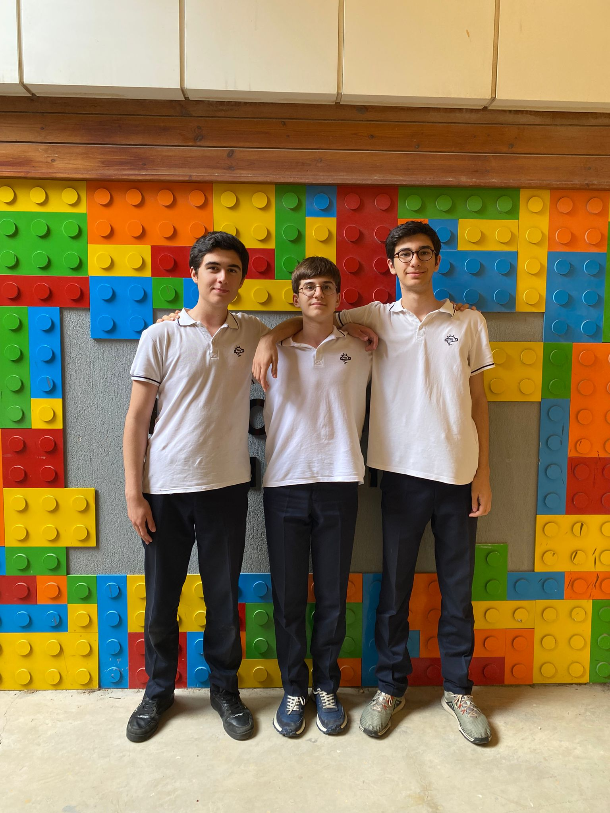
      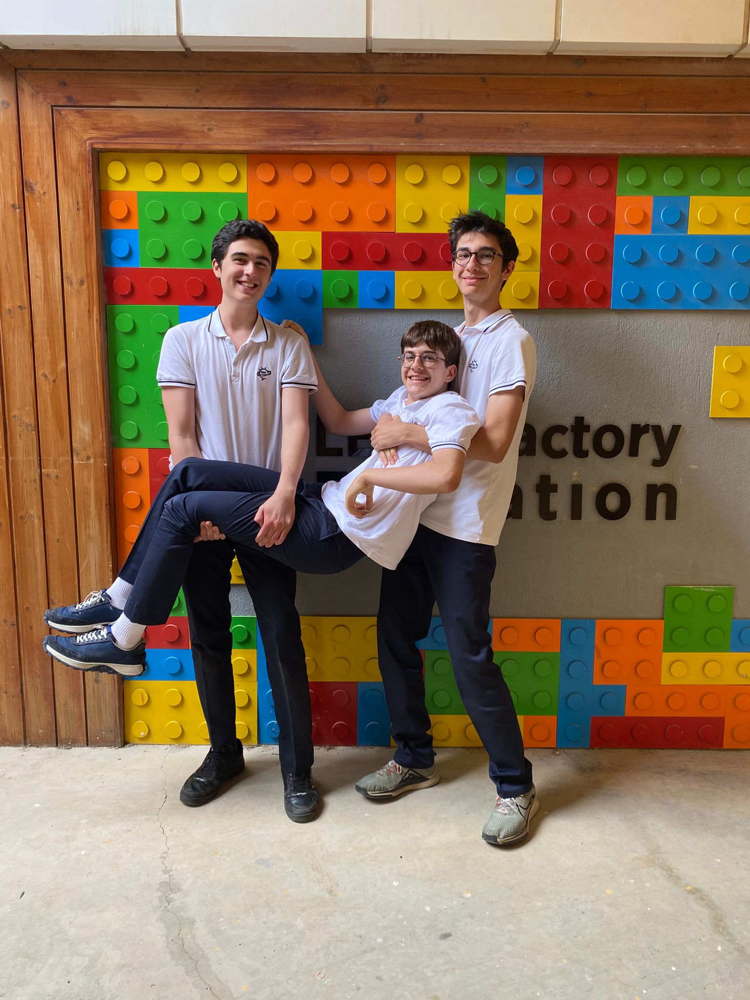
    </td>
    <td valign="top" style="padding-left: 0px;" border="0">
        This repository details team <em>Çakatech</em>'s building and programming process in the 2026 WRO Future Engineers Competition. 
      We are team <em>Çakatech</em>, three students who are passionate about technology and robotics. For this competition we built an autonomous vehicle. We worked after school and on weekends. Through this competition, we learned how to work as a team and solve problems related to robotics.
       </p>
        <strong>Team Members:</strong>
      <ul>
        <li>Batuhan Pekcan, 16</li>
        <li>Deniz Türker, 16</li>
        <li>Ali Aslan İşkol, 15</li>
      </ul>
      </p>
    </td>
  </tr>
</table>

[](https://www.youtube.com/@Saybrone/shorts)


# Table of Contents
- [Folder Contents](#folder-contents)
- [The Challenge](#the-challenge)
- [Vehicle Overview](#vehicle-overview)
  - [V-Photos](#v-photos)
  - [Hardware Components](#hardware-components)
  - [Electronic Components](#electronic-components)
  - [Mobility Management](#mobility-management)
    - [Powertrain](#powertrain)
    - [Steering](#steering)
    - [Chassis](#chassis)
- [Power and Sense Management](#power-and-sense-management)
  - [Li-ion Battery](#li-ion-battery)
  - [IMU Sensor](#imu-sensor)
  - [OpenMV Cam RT1062](#camera)
  - [EVN Alpha](#evn-alpha)
- [Software Components](#software-components)
  - [EVN Alpha Side](#evnalpha-side)
  - [OpenMV Camera Side](#openmv-side)
- [License](#license)

# Folder Contents <a class="anchor" id="folder-contents"></a>
* `models` is for the 3D files we used to print our parts
* `other` includes other files which can be used to understand how to prepare the vehicle for the competition. It includes documentations, datasets, hardware specifications, communication protocols,  descriptions etc.
* `schemes` contains schematic diagrams of the electromechanical components illustrating all the elements (electronic components and motors) used in the vehicle and how they connect to each other.
* `src` contains code of control software for all components which were programmed to participate in the competition
* `t-photos` contains photos of the team and logos
* `v-photos` contains 6 photos of the vehicle from various angles
* `video` contains the video.md file with the link to our YouTube channel and the respective videos

# The Challenge <a class="anchor" id="the-challenge"></a>

In the **[WRO 2026 Future Engineers – Self-Driving Cars](https://wro-association.org/)** category, teams are tasked with creating a robotic vehicle that can autonomously navigate a changing racetrack. Each round introduces new track layouts, requiring vehicles to adapt in real time.
The competition highlights the full engineering process:

- **Vehicle Design**: Building a functional robot with electromechanical components and advanced steering or motion systems.
- **Obstacle Management**: Applying computer vision, sensor fusion, and motion planning to make real-time decisions.
- **Project Documentation**: Maintaining an engineering journal and sharing designs in a public GitHub repository.

Teams are judged on performance, innovation, reliability, and the clarity of their engineering process, encouraging creativity, teamwork, and STEM skills.

Learn more about the challenge [here](https://wro-association.org/wp-content/uploads/WRO-2026-Future-Engineers-Self-Driving-Cars-General-Rules.pdf).

# Vehicle <a class="anchor" id="vehicle-overview"></a>


## V-Photos <b class="anchor" id="v-photos"></a>
| 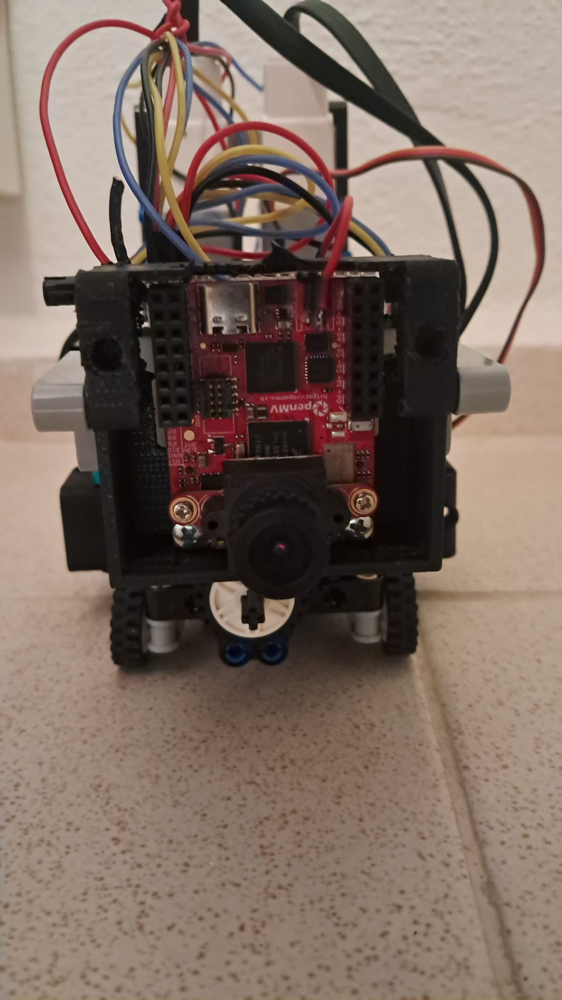 | 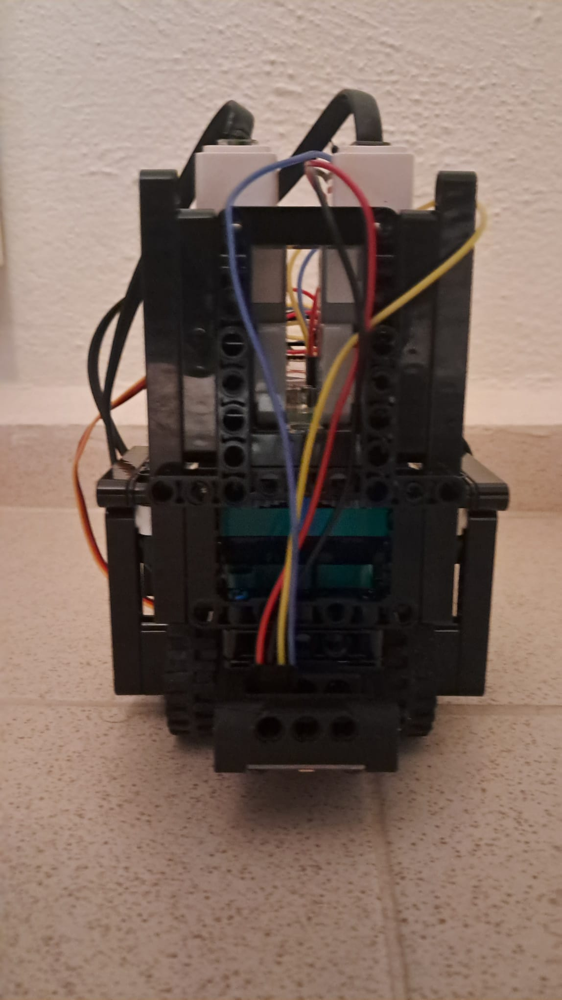 | 
| :--: | :--: | 
| *Front* | *Back* |
| 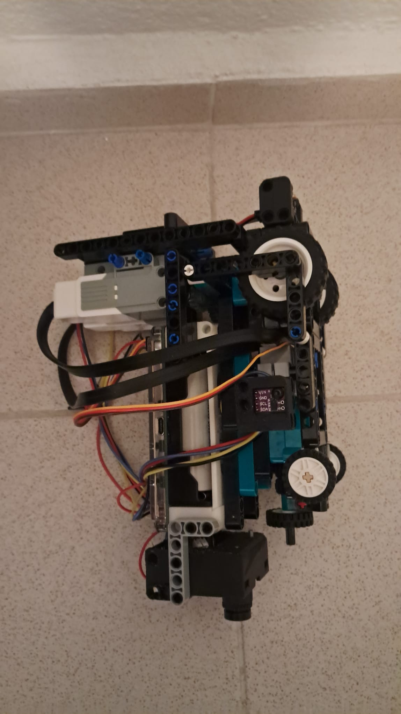 | 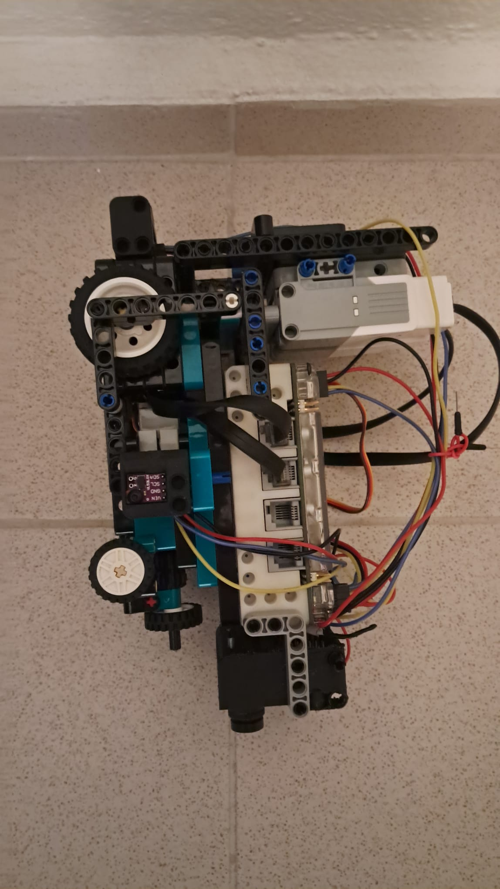 | 
| *Left* | *Right* |
| 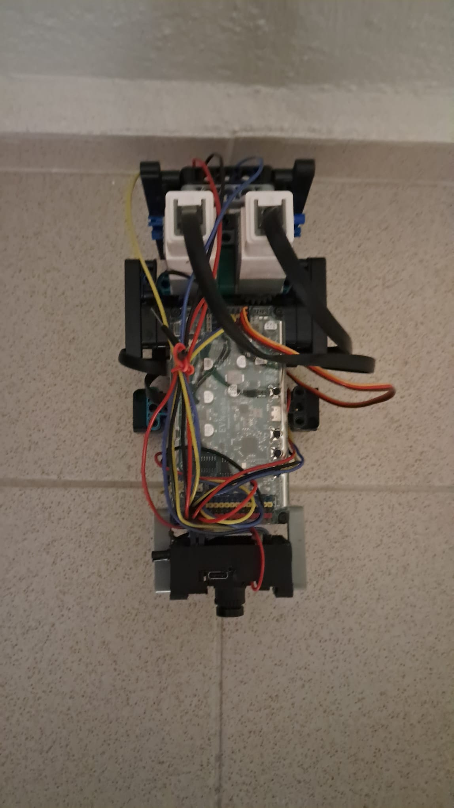 | 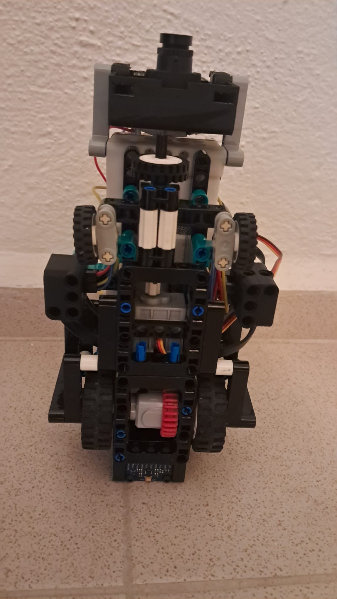 | 
| *Top* | *Bottom* |

<br>

# Hardware Components <a class="anchor" id="hardware-components"></a>
This section covers all the parts utilized in the vehicle, such as motors, sensors, controllers, chassis, mechanical systems, and other components.
## Electronic Components <a class="anchor" id="electronic-components"></a>
<table border="1" cellpadding="12" cellspacing="0">
  <thead>
    <tr>
      <th>Component</th>
      <th>Description / Link</th>
      <th>Image</th>
      <th>Price</th>
    </tr>
  </thead>
  <tbody>
    <tr>
      <td>Motor</td>
      <td>EV3 Medium Motor</td>
      <td>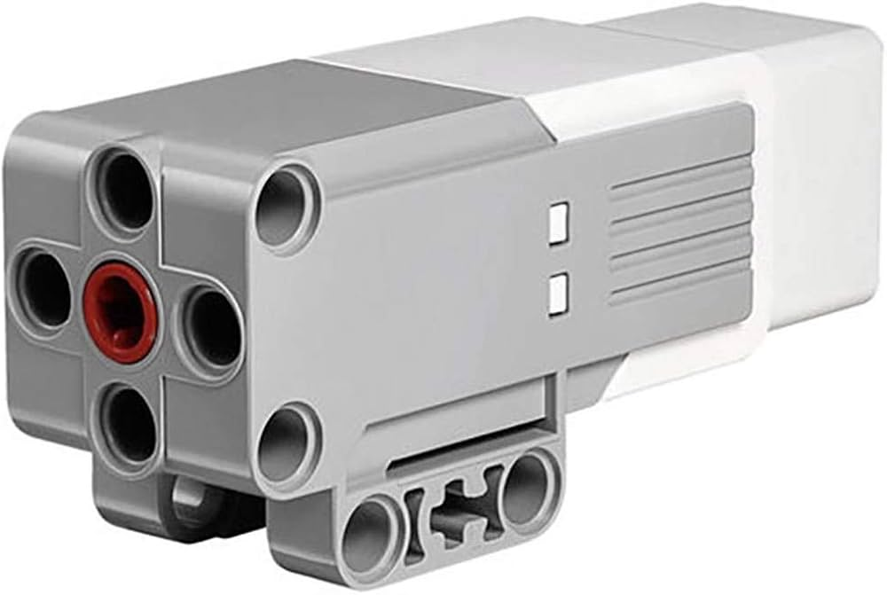
      <td>$125x2</td>
    </tr>
    <tr>
      <td>Servo Motor</td>
      <td>GeekServo (360 degrees)</a></td>
      <td>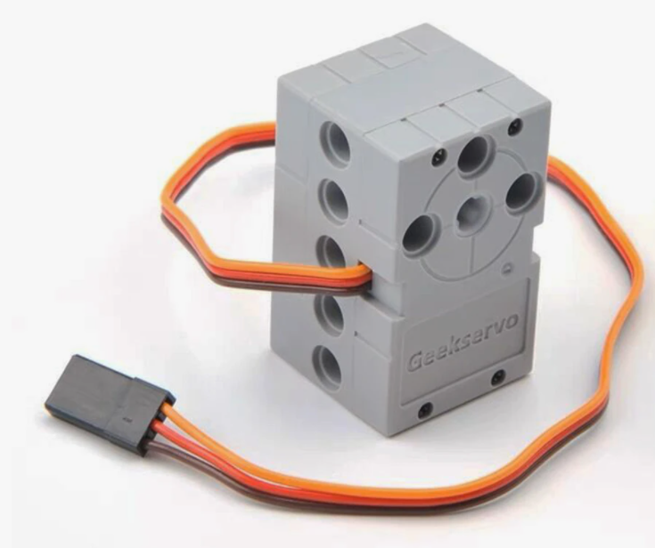
      <td>$10</td>
    </tr>
  <tr>
    <tr>
      <td>Motor Controller and Processor</td>
      <td>EVN Alpha</a></td>
      <td>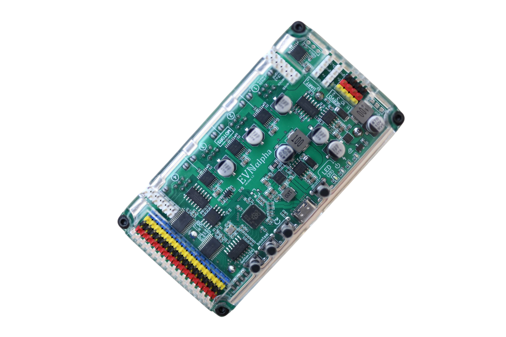</td>
      <td>$168</td>
    </tr>
      <td>IMU</td>
      <td>MPU 6500 Gyro Sensor</td>
      <td>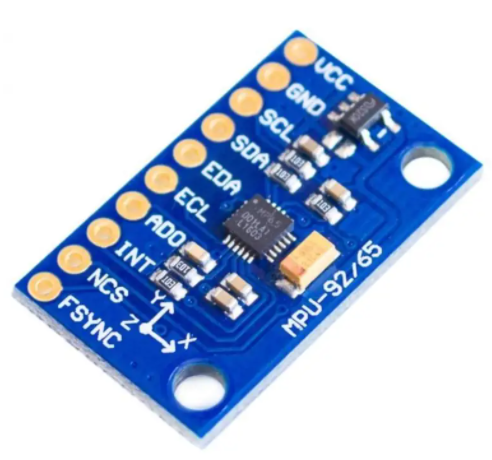
      <td>$1.88</td> 
    <tr>
      <td>Battery</td>
      <td>Molicel 35A Li-ion battery</td>
      <td>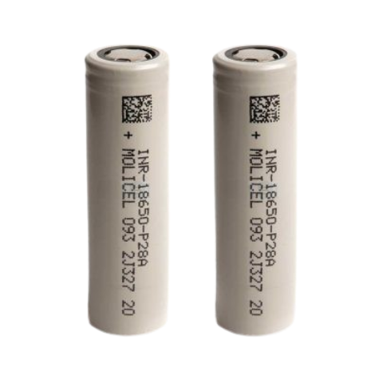
      <td>$10x2</td>
    </tr>
    </tr>
    <tr>
      <td>Camera</td>
      <td>OpenMV Cam RT1062</a></td>
      <td>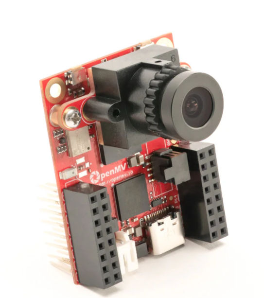
      <td>$120</td>
    </tr>
    <tr>
      <td>Time of Flight Sensors</td>
      <td>VL53L0X ToF Distance Sensor</a></td>
      <td>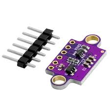
      <td>$2.66x2</td>
    </tr>
    <tr>
      <td>Lego Differential</td>
      <td>Lego Differential</td>
      <td>
      <td>$2.96</td> 
    <tr>
      <td colspan="3"><strong>Total Cost</strong></td>
      <td><strong>$878.06</strong></td>
    </tr>
  </tbody>
</table>

## Mobility Management <a class="anchor" id="mobility-management"></a>

Our robot’s mobility depends on the coordination of its powertrain, steering system, and chassis. Together, these components provide stability, control, and efficiency, enabling smooth and reliable movement.

### Powertrain <a class="anchor" id="powertrain"></a>
The powertrain converts electrical energy into mechanical motion, driving the robot’s wheels for movement and obstacle navigation.

#### Motor
<table>
<tr>
<td>

</td>

<td valign="top" style="padding-left: 15px;">

<b>Specifications (per motor):</b><br>
Rated Voltage: 9V<br>
Weight: 80g<br>
No-Load Speed: ~240 RPM<br>
Stall Torque: ~8 N·cm<br>
Integrated Rotation Sensor: 1° Resolution<br>
Connector: LEGO EV3/RJ12<br>
<br>
This project uses <b>two LEGO EV3 Medium Motors</b> as the primary actuators. These motors are designed for applications requiring <b>precise control</b> and <b>fast response</b>, making them ideal for robotic mechanisms and mobile platforms.
<br><br>
The built-in <b>high-resolution rotation sensor</b> enables accurate position and speed feedback, allowing for reliable closed-loop control. This feature is particularly useful for tasks that require precise movements, such as navigation and steering.
<br><br>
</td>
</tr>
</table>

  
#### Differential
<table> <tr><td> <td valign="top" style="padding-left: 15px;"> <b>Specifications:</b><br> Dimensions: 23 x 16 x 11 cm <br> Weight: 18 g <br><br>This Lego Differential is fully compatible with 3D shapes and Lego parts, allowing for seamless integration. It also features a 28 Teeth Differential Gear with a round axle design, providing smooth rotational movement for our robot. </td> </tr> </table>

### Steering <a class="anchor" id="steering"></a>
Our robot uses a **Ackermann steering** where the wheels are turned with linkage geometry. This method makes the robot easier to turn and keeps the overall design compact. It is highly effective for lightweight and fast-moving prototypes where simplicity and space efficiency are key.

#### Servo Motor
<table> <tr><td> <td valign="top" style="padding-left: 15px;"> <b>Specifications:</b><br> Operating Voltage: 3.3V~6V<br> Rated Voltage: 4.8V<br> Rotational range: 360°<br> Maximum Torque: 1.6kg±0.2kg/cm (4.8V)<br> Maximum Speed: 45rpm (3V)<br> Weight: 20g<br><br> For steering we selected the <b>GeekServo</b>. This motor is compatible with Lego Technic parts and offers a higher speed compared to 9g motors. The output shaft features a Lego Technic axle connector, making it ideal for applications that require a high-power drive. </td> </tr> </table> 

### Chassis <a class="anchor" id="chassis"></a>
Our chassis combines LEGO components with custom 3D-printed parts, creating a reliable and durable structure. The chassis provides mounting points for all motors, controllers, and sensors, ensuring stable alignment and easy integration. Below, 3D models of the parts are included.


#### OpenMV Backpack
</p> 

[3D Model](/models/backpackOpenMV/backpackOpenMV.stl)

#### Electronic Diagram
</p> 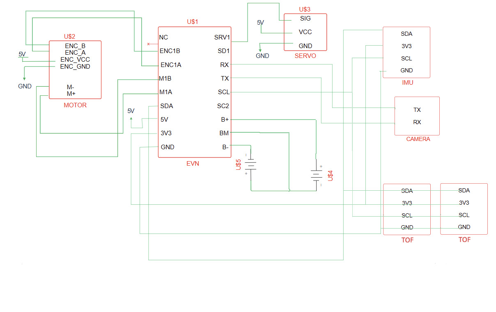
       
## Power and Sense Management <a class="anchor" id="power-and-sense-management"></a>


### Li-ion Battery <a class="anchor" id="li-ion-battery"></a>
<table> <tr><td> <td valign="top" style="padding-left: 15px;"> <b>Specifications:</b><br> Voltage: 3.7V <br>Capacity:2800mAh<br> Diameter: 18mm <br> Length: 65mm <br></td> </tr> </table> 

### IMU <a class="anchor" id="imu-sensor"></a>
<table> <tr><td>  <b>Specifications:</b><br> Gyroscope Range: ±250, ±500, ±1000, ±2000 °/s<br>Accelerometer Range: ±2g, ±4g, ±8g, ±16g<br> Interface : I2C <br>Power Supply: 3.5V  <br> </td> </tr> </table> The MPU-6500 is a 6-axis MotionTracking sensor that combines a 3-axis gyroscope and a 3-axis accelerometer in a compact 3x3x0.9 mm package. This integration allows reliable motion detection and orientation tracking with reduced size and complexity. We selected the MPU-6500 because it provides reliable motion tracking, low power consumption, and small form factor, making it well-suited for our vehicle’s navigation and stability control.

### OpenMV Cam RT1062 <a class="anchor" id="camera"></a>
<table> <tr> <td>
 </td> <td valign="top" style="padding-left: 15px;"> <b>Specifications:</b><br> Microcontroller: ARM Cortex M7 (RT1062)<br>Frequency: 600 MHz<br> RAM: 32 MB SDRAM + 1 MB SRAM <br> Flash Memory: 16 MB program/storage flash<br>Camera Resolution: 2592 × 1944 (5 MP) <br> Frame Rate:~40 FPS on QVGA (320 × 240) <br><br> This <b>OpenMV Cam -RT1062</b> is the one we used in our robot. The OpenMV Cam is a small, low-power microcontroller board that we used in our robot to implement machine vision applications. We program the OpenMV Cam in high-level Python scripts (via the MicroPython Operating System) instead of C/C++, which makes it much easier to handle the complex outputs of machine vision algorithms and work with high-level data structures. At the same time, we retain full control over the OpenMV Cam and its I/O pins in Python. This allows our robot to locate obstacles, lines and walls, enabling intelligent, autonomous behaviors. </td> </tr> </table>


### EVN Alpha <a class="anchor" id="evn-alpha"></a>
<table> <tr> <td>
 </td> <td valign="top" style="padding-left: 15px;"> <b>The EVN ALPHA is a compact robot controller based on the RP2040, housed in a LEGO Technic-compatible shell. It provides 26 I/O channels for controlling brushed DC motors, servos, and connecting UART or I2C peripherals. The board also integrates a 2-cell Lithium-Ion power management system, offering charging, cell balancing, and voltage regulation, making it ideal for safely powering and controlling our robot’s motors and sensors.</td> </tr> </table>
   
## Software Components <a class="anchor" id="software-components"></a>
### EVN Alpha Side <a class="anchor" id="evnalpha-side"></a>
```ino
#include <EVN.h>
#include <SoftwareSerial.h>
#include <math.h>

// -----------------------------------------------------------------------
// Port assignments
// -----------------------------------------------------------------------
#define SERVO_DIR_PORT        1
#define IMU_I2C_PORT          1
#define TOF_LEFT_PORT         3
#define TOF_RIGHT_PORT        2
#define PPR_VALUE             2200

// -----------------------------------------------------------------------
// Servo positions
// -----------------------------------------------------------------------
const float SERVO_CENTER = 133;
const int   SERVO_RIGHT  = 70;
const int   SERVO_LEFT   = 210;

// -----------------------------------------------------------------------
// Turn PD tuning
// -----------------------------------------------------------------------
#define TURN_KP               16.0f
#define TURN_KD               0.8f
#define TURN_SPEED_MAX        1000
#define TURN_SPEED_MIN        400
#define TURN_TOLERANCE        1.0f

// -----------------------------------------------------------------------
// Straight drive PD tuning
// -----------------------------------------------------------------------
#define STRAIGHT_KP           8.0f
#define STRAIGHT_KD           0.4f
#define STRAIGHT_SPEED        1000
#define STRAIGHT_DISTANCE_CM  50.0f

// -----------------------------------------------------------------------
// Wall / proximity config
// -----------------------------------------------------------------------
#define WALL_FOLLOW_SPEED     800
#define WALL_KP               0.5f
#define WALL_KD               0.02f
#define WALL_MAX_CORRECTION   60.0f
#define NO_WALL_MM            10000.0f
#define WALL_TOO_CLOSE_MM     50.0f
#define WALL_CLOSE_KP         1.2f
#define WALL_CLOSE_KD         0.05f
// -----------------------------------------------------------------------
// Pillar avoidance config
// -----------------------------------------------------------------------
// When a pillar error (pixels from center) exceeds this, start correcting
#define PILLAR_ERROR_THRESHOLD   300
// How strongly to steer toward correct side per pixel of error
#define PILLAR_STEER_KP          3.5f
// Minimum pillar area (pixels^2) to act on — filters distant/noise blobs
#define PILLAR_MIN_AREA          50
// Speed while actively avoiding a pillar
#define PILLAR_AVOID_SPEED       800
// Normal cruising speed between pillars
#define CRUISE_SPEED             800

// -----------------------------------------------------------------------
// Lap / direction config
// -----------------------------------------------------------------------
// Total corners to navigate for 3 laps
#define TOTAL_CORNERS            12
// Brightness threshold: below this means wall (corner) detected
#define BRIGHTNESS_WALL_THRESH   30.0f

// -----------------------------------------------------------------------
// OpenMV UART
// -----------------------------------------------------------------------
#define OPENMV_RX_PIN  1
#define OPENMV_TX_PIN  0
#define UART_TIMEOUT   500

// -----------------------------------------------------------------------
// Wheel geometry
// -----------------------------------------------------------------------
#define WHEEL_DIAMETER_MM     43.2f
#define GEAR_RATIO            1.0f

// -----------------------------------------------------------------------
// Hardware objects
// -----------------------------------------------------------------------
EVNAlpha          board;
EVNMotor          motor_left(1, EV3_MED);
EVNMotor          motor_right(2, EV3_MED);
EVNServo          steeringServo(SERVO_DIR_PORT);
EVNIMUSensor      imu(IMU_I2C_PORT);
EVNDistanceSensor tof_left(TOF_LEFT_PORT);
EVNDistanceSensor tof_right(TOF_RIGHT_PORT);
SoftwareSerial    openmv(OPENMV_RX_PIN, OPENMV_TX_PIN);
int locked_turn_dir = 0;
// -----------------------------------------------------------------------
// Shared gyro state
// -----------------------------------------------------------------------
volatile float yaw_angle = 0.0f;

// -----------------------------------------------------------------------
// Driving direction: +1 = clockwise (orange seen first, turn right = +90)
//                   -1 = counter-clockwise (blue seen first, turn left = -90)
// -----------------------------------------------------------------------
int drive_direction = 0;  // determined at start

// -----------------------------------------------------------------------
// setup / setup1
// -----------------------------------------------------------------------
void setup() {
  Serial.begin(9600);
  board.begin();
  board.setLinkLED(true);
  board.setMode(BUTTON_TOGGLE);
  imu.begin();
  imu.setGyroRange(IMU_GYRO_DPS_1000);
  tof_left.begin();
  tof_right.begin();
  openmv.begin(9600);
  delay(1000);
}

void setup1() {
  motor_left.begin();
  motor_right.begin();
  steeringServo.begin();
  steeringServo.write(SERVO_CENTER);
}

// -----------------------------------------------------------------------
// getYaw — fixed-rate gyro integration
// -----------------------------------------------------------------------
float getYaw() {
  static unsigned long last_us = micros();

  while ((micros() - last_us) < 2000UL);
  unsigned long now = micros();
  float dt = (now - last_us) / 1000000.0f;
  last_us = now;

  float gz = imu.readGyroZ();
  if (fabs(gz) < 0.1f) gz = 0;

  float y = yaw_angle + gz * dt;
  if (y >  180.0f) y -= 360.0f;
  if (y < -180.0f) y += 360.0f;
  yaw_angle = y;
  return yaw_angle;
}
void turnByDegreeReverse(float start_degree, float target_degrees,
                         int speed_min   = TURN_SPEED_MIN,
                         int speed_max   = TURN_SPEED_MAX,
                         float kp        = TURN_KP,
                         float kd        = TURN_KD,
                         float tolerance = TURN_TOLERANCE) {

  float goal_yaw = start_degree + target_degrees;
  float error = goal_yaw - getYaw();
  float prev_error = error;

  // Reverse steering logic
  steeringServo.write(error > 0 ? SERVO_LEFT : SERVO_RIGHT);
  delay(200);

  while (fabs(error) > tolerance) {

    prev_error = error;

    error = goal_yaw - getYaw();
    if (error > 180.0f) error -= 360.0f;
    if (error < -180.0f) error += 360.0f;

    float derivative = error - prev_error;

    int speed = (int)constrain(
      fabs(kp * error + kd * derivative),
      (float)speed_min,
      (float)speed_max
    );

    // Steering reversed because car is backing up
    steeringServo.write(error > 0 ? SERVO_LEFT : SERVO_RIGHT);

    motor_left.runSpeed(-speed);
    motor_right.runSpeed(-speed);
  }

  steeringServo.write(SERVO_CENTER);
  motor_left.runSpeed(0);
  motor_right.runSpeed(0);
}
// -----------------------------------------------------------------------
// turnByDegree — PD, full servo lock
// -----------------------------------------------------------------------
void turnByDegree(float start_degree, float target_degrees,
                  int speed_min   = TURN_SPEED_MIN,
                  int speed_max   = TURN_SPEED_MAX,
                  float kp        = TURN_KP,
                  float kd        = TURN_KD,
                  float tolerance = TURN_TOLERANCE) {

  float goal_yaw   = start_degree + target_degrees;
  float error = goal_yaw - getYaw();
  float prev_error = error;

  steeringServo.write(error > 0 ? SERVO_RIGHT : SERVO_LEFT);
  delay(200);

  while (fabs(error) > tolerance ) {
    prev_error = error;
    error = goal_yaw - getYaw();
    if (error >  180.0f) error -= 360.0f;
    if (error < -180.0f) error += 360.0f;

    float derivative = error - prev_error;
    int speed = (int)constrain(
      fabs(kp * error + kd * derivative),
      (float)speed_min,
      (float)speed_max
    );

    steeringServo.write(error > 0 ? SERVO_RIGHT : SERVO_LEFT);
    motor_left.runSpeed(speed);
    motor_right.runSpeed(speed);
  }

  steeringServo.write(SERVO_CENTER);
  motor_left.runSpeed(0);
  motor_right.runSpeed(0);
}
int timeout = 500;
// -----------------------------------------------------------------------
// driveStraight — PD, encoder distance
// -----------------------------------------------------------------------
void driveStraight(float start_degree,
                   int   drive_speed = STRAIGHT_SPEED,
                   float distance_cm = STRAIGHT_DISTANCE_CM,
                   float kp          = STRAIGHT_KP,
                   float kd          = STRAIGHT_KD,
                   float gear_ratio  = GEAR_RATIO) {

  float wheel_circ_cm = PI * (WHEEL_DIAMETER_MM / 10.0f);
  float target_ticks  = (distance_cm / wheel_circ_cm) * gear_ratio * PPR_VALUE;

  long start_left  = motor_left.getPosition();
  long start_right = motor_right.getPosition();
  float prev_error = 0.0f;

  while (true) {
    float travelled = (fabs(motor_left.getPosition()  - start_left) +
                       fabs(motor_right.getPosition() - start_right)) / 2.0f;
    if (travelled >= target_ticks) break;

    float error = getYaw() - start_degree;
    if (error >  180.0f) error -= 360.0f;
    if (error < -180.0f) error += 360.0f;

    float derivative = error - prev_error;
    prev_error = error;

    float servo_pos = constrain(
      SERVO_CENTER + kp * error + kd * derivative,
      (float)SERVO_RIGHT,
      (float)SERVO_LEFT
    );

    steeringServo.write(servo_pos);
    motor_left.runSpeed(drive_speed);
    motor_right.runSpeed(drive_speed);
  }

  steeringServo.write(SERVO_CENTER);
  motor_left.runSpeed(0);
  motor_right.runSpeed(0);
}

// -----------------------------------------------------------------------
// OpenMV communication helpers
// -----------------------------------------------------------------------
char m[100];
String readMessage() {
  bool started = false;
  int i = 0;
  unsigned long startTime = millis();

  while (true) {
    getYaw();
    if (openmv.available() > 0) {
      char c = openmv.read();
      if (c == '<') {
        started = true;
        i = 0;
      } else if (c == '*' && started) {
        m[i] = '\0';
        String result = String(m);
        Serial.println(result);
        openmv.write('0');
        return result;
      } else if (started && i < (int)sizeof(m) - 1) {
        m[i++] = c;
      }
    }
    if (millis() - startTime > timeout) return "";
  }
}

String requestGreen() {
  openmv.write('1');
  return readMessage();
}

String requestRed() {
  openmv.write('2');
  return readMessage();
}

String requestBrightness() {
  openmv.write('3');
  String msg = readMessage();
  if (msg == "") msg = "100";
  return msg;
}

String requestOrange() {
  openmv.write('4');
  String msg = readMessage();
  if (msg == "") msg = "False";
  return msg;
}

String requestBlue() {
  openmv.write('5');
  String msg = readMessage();
  if (msg == "") msg = "False";
  return msg;
}

// -----------------------------------------------------------------------
// parsePillarResponse
// Parses OpenMV response like "[3200, -45]?[1800, 12]?" into the
// largest-area blob's area and pixel error from center.
// Returns false if no valid blob found.
// -----------------------------------------------------------------------
bool parsePillarResponse(String response, int &area, int &error) {
  area  = 0;
  error = 0;

  if (response.length() == 0) return false;

  int best_area  = 0;
  int best_error = 0;
  bool found = false;

  int idx = 0;
  while (idx < (int)response.length()) {
    int open  = response.indexOf('[', idx);
    int close = response.indexOf(']', idx);
    if (open < 0 || close < 0) break;

    String entry = response.substring(open + 1, close);
    int comma = entry.indexOf(',');
    if (comma > 0) {
      int a = entry.substring(0, comma).toInt();
      int e = entry.substring(comma + 1).toInt();
      if (a > best_area) {
        best_area  = a;
        best_error = e;
        found = true;
      }
    }
    idx = close + 1;
  }

  if (found) {
    area  = best_area;
    error = best_error;
  }
  return found;
}

// -----------------------------------------------------------------------
// detectDirection
// Determines CW (+1) or CCW (-1) by looking for orange or blue line.
// Drives slowly forward until a line is seen.
// Returns +1 (orange/clockwise) or -1 (blue/counter-clockwise).
// -----------------------------------------------------------------------
int detectDirection() {
  float start_yaw = getYaw();

  while (true) {
    float error = getYaw() - start_yaw;
    if (error >  180.0f) error -= 360.0f;
    if (error < -180.0f) error += 360.0f;

    steeringServo.write(constrain(
      SERVO_CENTER + STRAIGHT_KP * error,
      (float)SERVO_RIGHT,
      (float)SERVO_LEFT
    ));
    motor_left.runSpeed(400);
    motor_right.runSpeed(400);

    if (requestOrange() == "True") {
      motor_left.runSpeed(0);
      motor_right.runSpeed(0);
      return 1;
    }
    if (requestBlue() == "True") {
      motor_left.runSpeed(0);
      motor_right.runSpeed(0);
      return -1;
    }
  }
}

// -----------------------------------------------------------------------
// avoidPillar
// Called when a pillar is visible ahead.
// Red pillar:   must pass to the RIGHT of robot → steer left to go around
// Green pillar: must pass to the LEFT of robot  → steer right to go around
//
// error from OpenMV: negative = pillar is left of camera center
//                    positive = pillar is right of camera center
void avoidPillar(bool is_red, int pillar_error, float heading) {
  unsigned long start_ms = millis();

  while (true) {
    String response = is_red ? requestRed() : requestGreen();
    int area = 0, px_error = 0;
    bool visible = parsePillarResponse(response, area, px_error);

    if (!visible || area < PILLAR_MIN_AREA) break;
    if (millis() - start_ms > 3000) break;

    float correction;
    if (is_red) {
      // RED: push pillar to the right → steer left (negative correction)
      correction = PILLAR_STEER_KP * (-PILLAR_ERROR_THRESHOLD - px_error);
    } else {
      // GREEN: push pillar to the left → steer right (positive correction)
      correction = PILLAR_STEER_KP * (PILLAR_ERROR_THRESHOLD - px_error);
    }

    // Wall avoidance on top of pillar steering
    float dist_left  = tof_left.read();
    float dist_right = tof_right.read();

    if (dist_left > 0 && dist_left < WALL_TOO_CLOSE_MM) {
      correction += WALL_CLOSE_KP * (WALL_TOO_CLOSE_MM - dist_left);   // steer right
    } else if (dist_right > 0 && dist_right < WALL_TOO_CLOSE_MM) {
      correction -= WALL_CLOSE_KP * (WALL_TOO_CLOSE_MM - dist_right);  // steer left
    }

    // Light gyro heading hold
    float gyro_err = getYaw() - heading;
    if (gyro_err >  180.0f) gyro_err -= 360.0f;
    if (gyro_err < -180.0f) gyro_err += 360.0f;

    float servo_pos = constrain(
      SERVO_CENTER + correction + STRAIGHT_KP * gyro_err * 0.3f,
      (float)SERVO_RIGHT, (float)SERVO_LEFT
    );

    steeringServo.write(servo_pos);
    motor_left.runSpeed(PILLAR_AVOID_SPEED);
    motor_right.runSpeed(PILLAR_AVOID_SPEED);
  }
}
// For RED (pass on right):
//   We want the pillar to end up on our right → steer LEFT (negative servo)
//   Target: keep error > +threshold (pillar stays right of center)
//
// For GREEN (pass on left):
//   We want the pillar to end up on our left → steer RIGHT (positive servo)
//   Target: keep error < -threshold (pillar stays left of center)
// -----------------------------------------------------------------------
bool checkAndAvoidPillar1(float heading) {
    // Get red detection
    String redResp = requestRed();
    int redArea = 0, redPxErr = 0;
    bool redDetected =
        parsePillarResponse(redResp, redArea, redPxErr) &&
        redArea >= PILLAR_MIN_AREA;

    // Get green detection
    String greenResp = requestGreen();
    int greenArea = 0, greenPxErr = 0;
    bool greenDetected =
        parsePillarResponse(greenResp, greenArea, greenPxErr) &&
        greenArea >= PILLAR_MIN_AREA;

    // Nothing detected
    if (!redDetected && !greenDetected) {
        return false;
    }

    // Choose the larger pillar
    if (redDetected && (!greenDetected || redArea >= greenArea)) {
        Serial.println("RED pillar selected (larger area), passing on right");

        avoidPillar(true, redPxErr, heading);

        driveStraight(heading, 800, 3.0, 0.5, 0.01, 1);
        turnByDegree(0, heading);
        delay(1000);
        driveStraight(heading,800,2,0.5,0.01,1);
        turnByDegree(0, heading - 60);
        turnByDegree(0, heading);

        return true;
    }

    // Green must be larger
    Serial.println("GREEN pillar selected (larger area), passing on left");

    avoidPillar(false, greenPxErr, heading);

    driveStraight(heading, 800, 3.0, 0.5, 0.01, 1);
    turnByDegree(0, heading);
    delay(1000);
    driveStraight(heading,800,2,0.5,0.01,1);
    turnByDegree(0, heading + 60);
    turnByDegree(0, heading);

    return true;
}
// -----------------------------------------------------------------------
// driveUntilCorner
// Drives forward avoiding any visible pillars until the camera detects
// a wall ahead (brightness < threshold), then stops.
// Returns immediately so the caller can do the corner turn.
// -----------------------------------------------------------------------
void driveUntilDark(float start_degree,
                    bool is_back=false,
                    int   corner_count  = 1,
                    int   speed         = WALL_FOLLOW_SPEED,
                    float bright_thresh = BRIGHTNESS_WALL_THRESH,
                    float too_close_mm  = WALL_TOO_CLOSE_MM,
                    float close_kp      = WALL_CLOSE_KP,
                    float gyro_kp       = STRAIGHT_KP,
                    float gyro_kd       = STRAIGHT_KD,
                    float close_kd      = WALL_CLOSE_KD) {

  float prev_gyro_error  = 0.0f;
  float prev_close_error = 0.0f;

  while (true) {
    // --- Brightness check ---
    String bright_str = requestBrightness();
    float brightness = bright_str.toFloat();
    String redResp = requestRed();
    int redArea = 0, redPxErr = 0;

    String greenResp = requestGreen();
    int greenArea = 0, greenPxErr = 0;

    bool redDetected =parsePillarResponse(redResp, redArea, redPxErr) && redArea >= PILLAR_MIN_AREA;
    bool greenDetected = parsePillarResponse(greenResp, greenArea, greenPxErr) && greenArea >= PILLAR_MIN_AREA;

    if (brightness < bright_thresh && !redDetected && !greenDetected) {
      motor_left.runSpeed(0);
      motor_right.runSpeed(0);
      steeringServo.write(SERVO_CENTER);

      // First corner: decide direction from ToF
      if (locked_turn_dir == 0) {
        float dist_left  = tof_left.read();
        float dist_right = tof_right.read();
        if (dist_left  <= 0) dist_left  = 0;
        if (dist_right <= 0) dist_right = 0;
        locked_turn_dir = (dist_left >= dist_right) ? -1 : 1;
      }

      // Turn to absolute heading: corner_count * 90 from origin (0)
      if (is_back){
        turnByDegreeReverse(start_degree, locked_turn_dir * corner_count * 90.0f);
      }else{
        turnByDegree(start_degree, locked_turn_dir * corner_count * 90.0f);
      }
      return;
    }

    // --- ToF close-wall PD correction ---
    float dist_left  = tof_left.read();
    float dist_right = tof_right.read();
    float correction = 0.0f;

    if (dist_left > 0 && dist_left < too_close_mm) {
      float close_error      = too_close_mm - dist_left;
      float close_derivative = close_error - prev_close_error;
      prev_close_error       = close_error;
      correction = close_kp * close_error + close_kd * close_derivative;

    } else if (dist_right > 0 && dist_right < too_close_mm) {
      float close_error      = too_close_mm - dist_right;
      float close_derivative = close_error - prev_close_error;
      prev_close_error       = close_error;
      correction = -(close_kp * close_error + close_kd * close_derivative);

    } else {
      // --- Gyro straight-hold PD ---
      prev_close_error = 0.0f;
      float gyro_error      = getYaw() - start_degree - locked_turn_dir*(corner_count-1)*90;
      float gyro_derivative = gyro_error - prev_gyro_error;
      prev_gyro_error       = gyro_error;
      Serial.println(gyro_error);
      correction = -(gyro_kp * gyro_error + gyro_kd * gyro_derivative);
    }

    float servo_pos = constrain(
      SERVO_CENTER - correction,
      (float)SERVO_RIGHT, (float)SERVO_LEFT
    );

    steeringServo.write(servo_pos);
    motor_left.runSpeed(speed);
    motor_right.runSpeed(speed);
  }
}

void pass_line(float heading){
  String grn_resp = requestGreen();
  int area = 0, px_err = 0;
  checkAndAvoidPillar1(heading);
  checkAndAvoidPillar1(heading);
  driveUntilDark(heading,false);
  driveStraight(heading+locked_turn_dir*90,-800,3,0.5,0.01,1);
}
// -----------------------------------------------------------------------
// parkingSequence
// After 3 laps the robot needs to find and enter the parking lot.
// The parking lot is in the starting section; the robot drives back
// toward it using gyro, detects the magenta markers with the ToF sensors,
// and performs parallel parking:
//   1. Drive to align past the far marker
//   2. Turn into the lot
//   3. Reverse in
//   4. Straighten up parallel to the wall
// -----------------------------------------------------------------------
// -----------------------------------------------------------------------
bool button_output = false;

void loop() {
  button_output = board.buttonRead(); 
  if (button_output) {
    float heading = getYaw();
    driveUntilDark(heading,false);
    driveStraight(heading+locked_turn_dir*90,-800,4,0.5,0.01,1);
    for(int i = 1;i<=12;i++){
      pass_line(heading+locked_turn_dir*90*i);
      delay(1000);
    }

    
    motor_left.runSpeed(0);
    motor_right.runSpeed(0);
    while(true){
      delay(100);
    }

  } else {
    motor_left.runSpeed(0);
    motor_right.runSpeed(0);
  }
}
```
### OpenMV Camera Side <a class="anchor" id="openmv-side"></a>

#### 1. Color Detection
- **Orange / Blue line**:  
  - Detects blobs in bottom ROI.  
  - Returns `True` if blob is large enough.  
- **Red / Green box**:  
  - Detects rectangular blobs.  
  - Filters by size and shape.  
  - Returns `[area, error]` for EVN Alpha.  

#### 2. Brightness Detection
- Reads a central ROI.  
- Computes average brightness.  
- Low brightness → wall detected.  

#### 3. UART Control
- Waits for EVN Alpha command.  
- Runs appropriate detection function.  
- Sends results back wrapped in `<...*>`.  

Example:  
- EVN Alpha sends `1`.  
- Camera detects green box.  
- Camera replies: `<500,20*>` (area=500, error=20px right).
```py
import sensor, time
from machine import UART

sensor.reset()
sensor.set_pixformat(sensor.RGB565)
sensor.set_framesize(sensor.QVGA)
sensor.set_auto_gain(False)
sensor.set_auto_whitebal(False)
#---Flips sensor data because it is upside down---
sensor.set_vflip(True)
sensor.set_hmirror(True)

sensor.skip_frames(time=2000)
uart1 = UART(1, baudrate=9600) #Starts Uart Communication in pin "P4" and "P5"

clock = time.clock()
img_width = sensor.width()
img_height = sensor.height()

#---Finds brightness in middle to detect wall---
def Find_MiddleBrightness(img):
    #---Defining a rectangle roi for middle---
    rect_x = int(img_width * 0.3)
    rect_y = int(img_height * 0.35)
    rect_w = int(img_width * 0.4)
    rect_h = int(img_height * 0.3)
    middle_roi = (rect_x, rect_y, rect_w, rect_h)

    #---Gets the average brightness of the pixels in roi---
    stats = img.get_statistics(roi=middle_roi)
    brightness = stats.mean()
    return brightness


#---Detects Orange Line to determine the direction---
def Find_Orange_Line(img):
    orange_threshold = (40, 51, -115, 68, 16, 29) #Color threshold used for orange

    #---Defines a rectangle roi for the floor---
    rect_x = int(0)
    rect_y = int(img_height * 0.3)
    rect_w = int(img_width)
    rect_h = int(img_height)
    lines_roi = (rect_x, rect_y, rect_w, rect_h)

    #---Finds similar colored pixel blocks---
    orange_blobs = img.find_blobs([orange_threshold], roi=lines_roi, area_threshold=3000)
    for blob in orange_blobs:
        img.draw_rectangle(blob.rect(),color=(0, 255, 0))
        return True #Returns True if sees an orange blob
    return False #Returns False if it doesn't see an orange blob


#---Detects Blue Line to determine the direction---
def Find_Blue_Line(img):
    blue_threshold = (35, 8, -128, 16, -128, -6) #Color threshold used for blue

    #---Defines a rectangle roi for the floor---
    rect_x = int(0)
    rect_y = int(img_height * 0.3)
    rect_w = int(img_width)
    rect_h = int(img_height)
    lines_roi = (rect_x, rect_y, rect_w, rect_h)
    img.draw_rectangle(lines_roi,color=(255, 0, 0))

    #---Finds similar colored pixel blocks---
    blue_blobs = img.find_blobs([blue_threshold], roi=lines_roi, area_threshold=3000)
    for blob in blue_blobs:
        img.draw_rectangle(blob.rect(),color=(0, 255, 0))
        print(blob.area())
        return True #Returns True if sees a blue blob

    return False #Returns False if it doesn't see a blue blob


#---Detects Red Rectangles (used for object tracking or direction)---
def Find_Red_Rect(img):
    red_threshold = (9, 72, 57, 22, -12, 57) #Color threshold used for red
    blobs_red = img.find_blobs([red_threshold], area_threshold=1000)

    rect = None
    center = None
    error = None
    area = None
    returnSTR = ""

    #---Draws cross at image center---
    img_center_x = img.width() // 2
    img_center_y = img.height() // 2
    img.draw_cross(img_center_x, img_center_y, color=(255, 0, 0))

    #---Finds blobs that match red threshold---
    for a in blobs_red:
        img.draw_rectangle(a.rect())
        x, y, w, h = a.rect()
        img.draw_cross(x + w // 2, y + h // 2)

        #---Check shape (elongation close to rectangle)---
        if a.elongation() < 1.2:
            area = a.area()
            rect = a.rect()
            x, y, w, h = rect
            center = (x + w // 2, y + h // 2)
            error = center[0] - img_center_x
            returnSTR = returnSTR + str([area, error])+"?"

    return returnSTR


#---Detects Green Rectangles (used for object tracking or direction)---
def Find_Green_Rect(img):
    green_threshold = (0, 52, -35, -15, -55, 17) #Color threshold used for green
    blobs_green = img.find_blobs([green_threshold], area_threshold=1000)

    rect = None
    center = None
    returnSTR = ""
    error = 0
    area = 0

    #---Draws cross at image center---
    img_center_x = img.width() // 2
    img_center_y = img.height() // 2
    img.draw_cross(img_center_x, img_center_y, color=(255, 0, 0))

    #---Finds blobs that match green threshold---
    for a in blobs_green:
        img.draw_rectangle(a.rect())
        x, y, w, h = a.rect()
        img.draw_cross(x + w // 2, y + h // 2)

        #---Check shape (elongation close to rectangle)---
        if a.elongation() < 1.2:
            area = a.area()
            rect = a.rect()
            x, y, w, h = rect
            center = (x + w // 2, y + h // 2)
            error = center[0] - img_center_x
            returnSTR = returnSTR + str([area, error])+"?"

    return returnSTR


#---Main Loop---
while True:
    clock.tick()  #Updates the FPS clock
    img = sensor.snapshot()  #Takes a picture from the camera

    #---Reads 1 byte from UART to decide which function to run---
    a = uart1.read(1)

    if a == b'1':
        #---Detects Green Rectangle and sends area + error via UART---
        uart1.write("<" + str(Find_Green_Rect(img)) + "*")
    elif a == b'2':
        #---Detects Red Rectangle and sends area + error via UART---
        uart1.write("<" + str(Find_Red_Rect(img)) + "*")
    elif a == b'3':
        #---Measures brightness in the middle ROI and sends value via UART---
        uart1.write("<" + str(Find_MiddleBrightness(img)) + "*")
    elif a == b'4':
        #---Detects Orange Line and sends True/False via UART---
        uart1.write("<" + str(Find_Orange_Line(img)) + "*")
    elif a == b'5':
        #---Detects Blue Line and sends True/False via UART---
        uart1.write("<" + str(Find_Blue_Line(img)) + "*")

    #---Debugging: print the received UART command and FPS---
    print(a)
    print(clock.fps())
    time.sleep(0.01)  #Small delay for stability
```

## License <a class="anchor" id="license"></a>

```
GNU General Public License v3.0

Copyright (C) 2007 Free Software Foundation, Inc. <https://fsf.org/>

This program is free software: you can redistribute it and/or modify
it under the terms of the GNU General Public License as published
by the Free Software Foundation, either version 3 of the License, or
(at your option) any later version.

This program is distributed in the hope that it will be useful,
but WITHOUT ANY WARRANTY; without even the implied warranty of
MERCHANTABILITY or FITNESS FOR A PARTICULAR PURPOSE. See the
GNU General Public License for more details.

You should have received a copy of the GNU General Public License
along with this program. If not, see <https://www.gnu.org/licenses/>.

